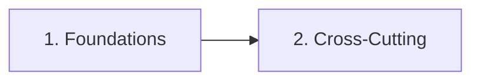

# Master Learning Path

**Overview**: The top-level curriculum through all chapters in this wiki. Each node is a chapter's learning path. This page is **dynamically updated during ingestion** — as new chapter folders are created and concepts accumulate, nodes are added, reordered, and branched to reflect the actual structure of the wiki. Nothing here is hardcoded; the sequence emerges from what you ingest.

**Estimated duration**: Varies — see individual chapter paths for per-chapter estimates.

**Prerequisite paths**: None — start at node 1.

---

## Visual Overview

---

## Path Sequence

### 1. [[concept/foundations/_learning-path|Foundations]]
**Prerequisites**: None
**Difficulty**: foundational
**Overview**: The essential building blocks every topic depends on — math, logic, reasoning patterns, and mental models. This chapter establishes the toolkit you'll reach for across every other chapter. Completing foundations first means you'll never hit a wall because you're missing a basic concept. Even if you're eager to jump into a specific topic, spending time here pays compounding returns as you progress.

### 2. [[concept/cross-cutting/_learning-path|Cross-Cutting Concepts]]
**Prerequisites**: [[concept/foundations/_learning-path|Foundations]] + at least one topic chapter
**Difficulty**: intermediate
**Overview**: The connective tissue between chapters — systems thinking, information theory, emergence, and other ideas that show up across disciplines. This chapter is best tackled after you have at least one domain chapter under your belt, because cross-cutting concepts make the most sense when you can map them onto concrete examples you've already learned. By the end, you'll see the hidden symmetries between topics that seemed unrelated, and you'll be able to transfer insights fluidly across domains.

---

## Dynamic zone

*The nodes below are **not hardcoded** — they are added, ordered, and branched by the AI during ingestion as new chapter folders are created. The sequence reflects the actual wiki content at any point in time.*

### How the master path evolves

| Trigger | Action |
|---------|--------|
| New chapter folder created | Insert a node linking to its `_learning-path.md`, positioned by prerequisites and difficulty |
| Two+ chapters share no dependencies | They become parallel options (no branch marker needed — just sequential nodes with no OR in prerequisites) |
| Two+ chapters naturally diverge in focus | A **branch point** is added so learners can choose their direction |
| A chapter accumulates enough advanced concepts | It may split or spawn an advanced successor chapter |

<!-- 
Node template for dynamically added chapters:
### N. [[concept/<chapter-name>/_learning-path|Chapter Title]]
**Prerequisites**: ...
**Difficulty**: beginner | intermediate | advanced
**Overview**: (3-5 sentences describing what this chapter covers and why it matters in the overall sequence.)
-->
