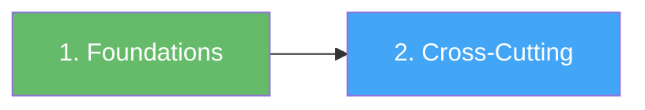
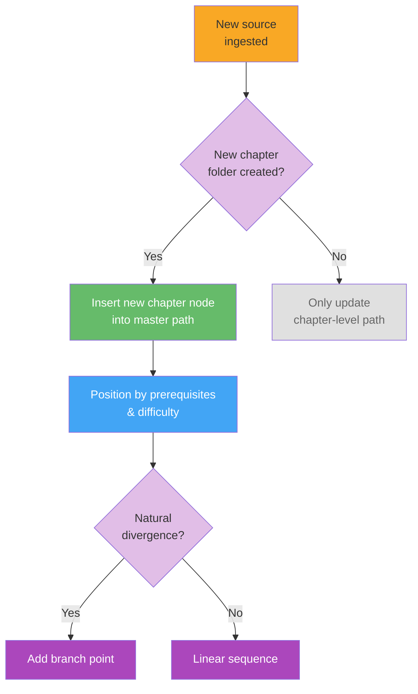

# Master Learning Path

> **TL;DR**: The top-level curriculum that sequences all chapters in this wiki. Start at Foundations (node 1), then move to Cross-Cutting Concepts (node 2). As new topic chapters are ingested, nodes are added dynamically — positioned by prerequisites and difficulty. This page tells you which order to tackle the chapters, where to branch, and how everything fits together [1].

---

## 1. What Is the Master Learning Path?

The master path is the **orchestrator** of your learning journey. While individual chapter paths sequence concepts within a topic, the master path sequences the chapters themselves. It answers one question: *"What should I learn next?"*

| Level | What it sequences | Example |
|-------|-------------------|---------|
| **Master path** (this page) | Chapters | Foundations → Machine Learning → Cross-Cutting |
| **Chapter path** | Concepts within a chapter | Probability → Bayes' Theorem → Information Theory |
| **Concept page** | One idea in depth | bayes-theorem (example) |

> **Dynamic by design**: Unlike a traditional curriculum, this path is never "finished." It grows, reorders, and branches as new sources are ingested. Every node here corresponds to a chapter folder that actually exists — there are no placeholders for hypothetical future chapters [1].

---

## 2. Visual Overview



> **Note**: Click any node in Obsidian to open that chapter's learning path. As new chapters are ingested, this chart grows — nodes appear, arrows connect them by dependency, and branch points emerge where paths diverge [1].

---

## 3. Path Sequence

### 1. [[concept/foundations/_learning-path|Foundations]]
**Prerequisites**: None
**Difficulty**: foundational
**Overview**: The essential building blocks every topic depends on — math, logic, reasoning patterns, and mental models. This chapter establishes the toolkit you'll reach for across every other chapter. Completing foundations first means you'll never hit a wall because you're missing a basic concept. Even if you're eager to jump into a specific topic, spending time here pays compounding returns as you progress.

### 2. [[concept/cross-cutting/_learning-path|Cross-Cutting Concepts]]
**Prerequisites**: [[concept/foundations/_learning-path|Foundations]] + at least one topic chapter
**Difficulty**: intermediate
**Overview**: The connective tissue between chapters — systems thinking, information theory, emergence, and other ideas that show up across disciplines. This chapter is best tackled after you have at least one domain chapter under your belt, because cross-cutting concepts make the most sense when you can map them onto concrete examples you've already learned. By the end, you'll see the hidden symmetries between topics that seemed unrelated, and you'll be able to transfer insights fluidly across domains.

---

## 4. How the Master Path Evolves

This section is the **dynamic zone** — it explains how the path grows, but the nodes themselves are added by the AI during ingestion, not written in advance.



---

### Evolution Rules

| Trigger | Action | Example |
|---------|--------|---------|
| **New chapter folder created** | Insert a node linking to its `_learning-path.md`, positioned by prerequisites and difficulty | `machine-learning/` appears → node placed after foundations |
| **Two+ chapters share no dependencies** | They become parallel options (sequential nodes, no OR in prerequisites) | ML and Philosophy both only need Foundations → sequential, learner picks order |
| **Two+ chapters naturally diverge in focus** | A **branch point** is added | After ML basics: Path A (NLP) vs Path B (Computer Vision) |
| **A chapter accumulates enough advanced concepts** | It may split or spawn an advanced successor chapter | `machine-learning/` → `deep-learning/` as separate chapter |

---

### Node Template

When a new chapter is ingested, each node follows this structure:

```
### N. [[concept/<chapter-name>/_learning-path|Chapter Title]]
**Prerequisites**: ...
**Difficulty**: beginner | intermediate | advanced
**Overview**: (3–5 sentences describing what this chapter covers and why it matters in the overall sequence.)
```

---

## 5. How to Use This Path

1. **Start at node 1 (Foundations)** — this is the only non-negotiable starting point
2. **Follow the linear sequence** — each node's prerequisites tell you what must come before
3. **When you hit a branch point**, read the descriptions and pick the path that matches your goal
4. **At merge points**, you can continue from either branch — both satisfy the prerequisite
5. **Revisit cross-cutting** after completing 1–2 topic chapters for deeper insights
6. **Check back periodically** — the path grows as new sources are ingested

> **Pro tip**: Don't feel pressured to complete every branch. The branching system exists so you can specialize without guilt. Pick the path that serves your goals and know that the other branches are there when you need them [1].

---

## References

[1] Project AGENTS.md — GengsuWiki repository. (2026). *Section: Learning Path System — "Master path sequences entire chapters. Updated only when the user asks to ingest a new source: new chapter = new node."*. `D:/PROJECTS/GengsuWiki/AGENTS.md`

[2] Ambrose, S. A., Bridges, M. W., DiPietro, M., Lovett, M. C., & Norman, M. K. (2010). *How learning works: Seven research-based principles for smart teaching*. Jossey-Bass.
