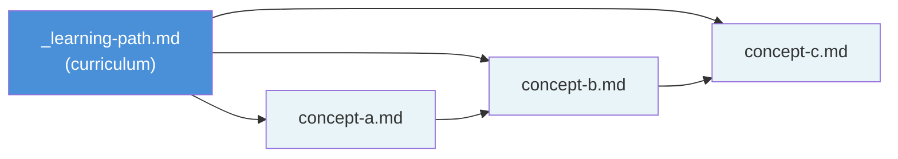
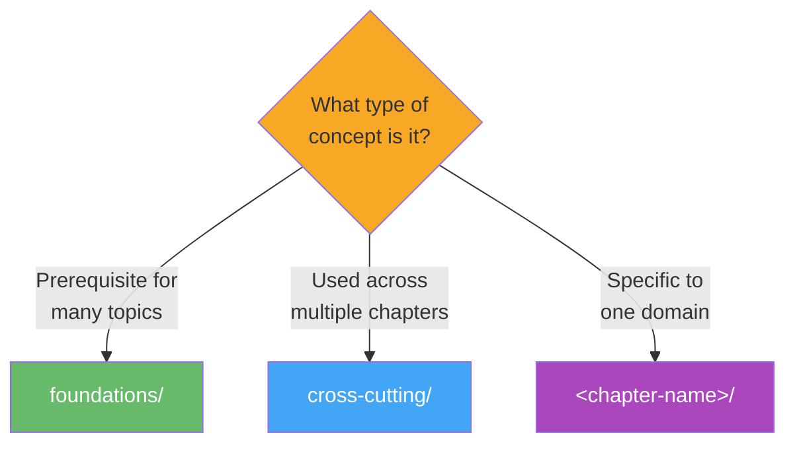

# Concept Directory Structure

> **TL;DR**: This directory holds all concept pages organized into chapter folders. Each chapter has a `_learning-path.md` that sequences its concepts into a structured curriculum. Two special folders — `foundations/` and `cross-cutting/` — house prerequisite building blocks and multi-domain ideas respectively. New chapters are added dynamically as sources are ingested.

---

## 1. Folder Layout

Every concept page lives inside a **chapter folder** under `wiki/concept/`. The structure follows a predictable pattern — one folder per broad topic, with a learning path at the top of each:

```
wiki/concept/
├── README.md                          ← you are here
├── foundations/                       ← fundamental building blocks
│   └── _learning-path.md              ← sequenced curriculum
├── cross-cutting/                     ← concepts spanning multiple domains
│   └── _learning-path.md
└── <chapter-name>/                    ← one folder per broad topic
    ├── _learning-path.md              ← sequenced curriculum for this topic
    ├── concept-a.md
    ├── concept-b.md
    └── ...
```

> **Why this structure?** Each chapter is self-contained — you can open a chapter folder and immediately see its learning path and all its concept pages. The underscore in `_learning-path.md` sorts it to the top of file listings so it's always the first thing you see [1].

---

## 2. Key Files

There are only two types of files inside a chapter folder:

| File | Purpose |
|------|---------|
| `_learning-path.md` | Structured curriculum — a sequenced list of concept nodes with prerequisites, difficulty ratings, and 3–5 sentence overviews per node. Supports branching for alternative learning routes. |
| `*.md` (any other) | A concept page — full explanation of one idea, with sources, YAML frontmatter, and wiki-links to related pages. |



> **How they relate**: The learning path points to concept pages in sequence. Concept pages link to each other via `[[wikilinks]]`, forming a dense web of cross-references [1].

---

## 3. Naming Conventions

Follow these rules to keep the wiki navigable and tooling-friendly:

| Element | Convention | Example |
|---------|-----------|---------|
| **Folder names** | lowercase with hyphens | `machine-learning`, `cognitive-science` |
| **Concept pages** | lowercase with hyphens | `backpropagation.md`, `working-memory.md` |
| **Learning paths** | always `_learning-path.md` | sorts to top of listings |
| **Special folders** | reserved names | `foundations/`, `cross-cutting/` |

> **Why lowercase with hyphens?** It ensures consistent URL-safe slugs, avoids cross-platform case-sensitivity issues (Windows vs. macOS vs. Linux), and makes `[[wikilinks]]` easier to type and autocomplete [2].

---

## 4. How Concepts Are Placed

When a new concept page is created (during source ingestion), it must be classified into the right folder:

| Concept type | Goes in | Example |
|-------------|---------|---------|
| **Fundamental building block** — needed to master any topic | `foundations/` | Probability theory, formal logic, scientific method |
| **Cross-domain idea** — used across multiple chapters | `cross-cutting/` | Systems thinking, information theory, emergence |
| **Domain-specific** — belongs to one topic area | `<chapter-name>/` | Backpropagation → `machine-learning/` |



> **Decision flow**: Start from the top — could this concept be a prerequisite for many chapters? If yes, it's foundational. If it spans multiple existing chapters but isn't a hard prerequisite, it's cross-cutting. Otherwise, find or create the chapter folder that best matches its primary domain [1].

---

## 5. The Learning Path Loop

This is how new content flows into the system:

1. **A source is ingested** → new concept pages are created or existing ones updated
2. **Each concept is classified** → placed into a chapter folder using the rules above
3. **The chapter's `_learning-path.md` is updated** → the new node is inserted in the correct sequence with prerequisites
4. **If a new chapter folder is created** → the master `_learning-path.md` gets a new node too
5. **`wiki/index.md` is checked** → ensures the new content is covered by existing `.base` views

This loop ensures the wiki stays organized no matter how much content you add [1].

---

## References

[1] Project AGENTS.md — GengsuWiki repository. (2026). *Section: Chapter Organization & Learning Path System*. `D:/PROJECTS/GengsuWiki/AGENTS.md`

[2] Gruber, J. (2004). *Markdown: Syntax*. Daring Fireball. https://daringfireball.net/projects/markdown/syntax
