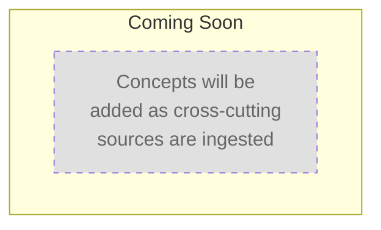
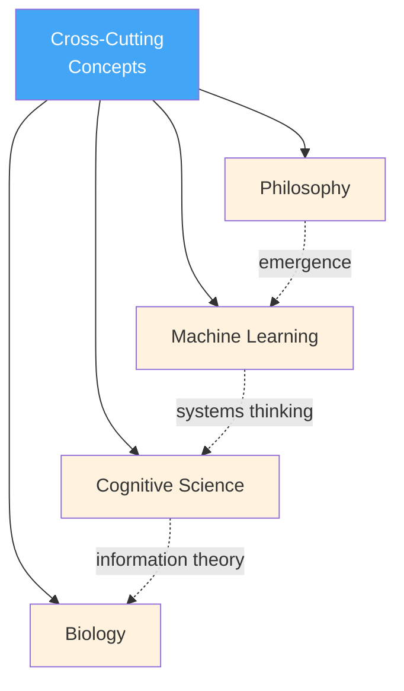

# Learning Path: Cross-Cutting Concepts

> **TL;DR**: Cross-cutting concepts are ideas that bridge multiple topic areas — systems thinking, information theory, emergence, and other patterns that show up across disciplines. Unlike foundations (which are prerequisites), cross-cutting concepts are best learned after you have at least one domain chapter under your belt. By the end, you'll see hidden symmetries between seemingly unrelated topics and transfer insights fluidly across domains [1].

---

## 1. What Are Cross-Cutting Concepts?

Cross-cutting concepts are the **connective tissue** of knowledge. They don't belong to any single domain — instead, they appear across many. Recognizing them is what separates a specialist who knows one field deeply from a polymath who can reason across fields.

| Cross-cutting concept | Shows up in... |
|-----------------------|----------------|
| Systems thinking | Biology, economics, software architecture, ecology |
| Information theory | Neuroscience, linguistics, cryptography, genetics |
| Emergence | Physics, sociology, AI, chemistry |
| Feedback loops | Engineering, climate science, psychology, business |

> **Why learn these after a domain chapter?** Cross-cutting concepts are abstract. They make the most sense when you can map them onto concrete examples you've already learned. If you try to learn systems thinking without having studied any system, it's just vocabulary. If you learn it after studying biology, suddenly it clicks [1].

---

## 2. Visual Overview

*Mermaid chart will appear here as concepts are ingested.*

> **Note**: Once concepts are added, this chart visualizes the learning sequence. Click any node in Obsidian to open that concept page.



---

## 3. Path Sequence

*No nodes yet. Concepts will be added here as cross-cutting sources are ingested.*

When concepts arrive, each node in this section will follow this pattern:

```
### N. [[concept-name]]
**Prerequisites**: ...
**Difficulty**: intermediate
**Overview**: (3–5 sentences describing what this concept is, which domains it bridges, and why it matters.)
```

---

## 4. How Cross-Cutting Concepts Bridge Domains



> **Solid arrows** show the learning path pointing to domain chapters. **Dotted arrows** show how cross-cutting concepts (labeled on each edge) create connections between otherwise separate domains. These hidden connections are the whole point [1].

---

## 5. Prerequisites & Positioning

| Requirement | Why |
|-------------|-----|
| **Foundations** (recommended) | You need basic reasoning tools before tackling abstract multi-domain ideas |
| **At least 1 topic chapter** (recommended) | Gives you concrete examples to anchor abstract concepts to |
| **No hard prerequisites** | Cross-cutting chapters can technically be read standalone — they just won't stick as well |

> **Position in the master path**: Cross-cutting sits at node #2, after foundations. But unlike foundations, it's not a hard prerequisite for topic chapters — it's something you dip into as your knowledge grows [1].

---

## 6. What To Expect

| Stage | What happens |
|-------|-------------|
| **Before ingestion** | This page is a skeleton — structure ready, zero content |
| **After first cross-cutting source** | 3–10 concept nodes appear in sequence, Mermaid chart populates |
| **After 3–5 cross-cutting sources** | Nodes may reorder, branch points may emerge, estimated duration updates |
| **Mature state** | 10–20 nodes covering the major lenses that cut across domains |

---

## References

[1] Project AGENTS.md — GengsuWiki repository. (2026). *Section: Chapter Organization — "cross-cutting/ — Concepts that bridge multiple chapter areas and don't belong to a single topic"*. `D:/PROJECTS/GengsuWiki/AGENTS.md`

[2] Morin, E. (2008). *On complexity*. Hampton Press.
