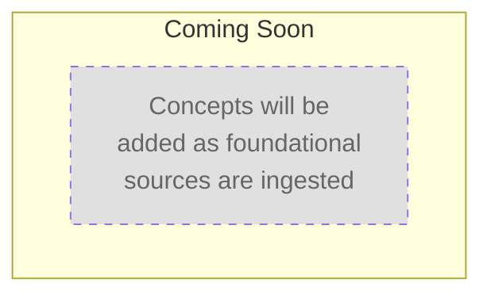
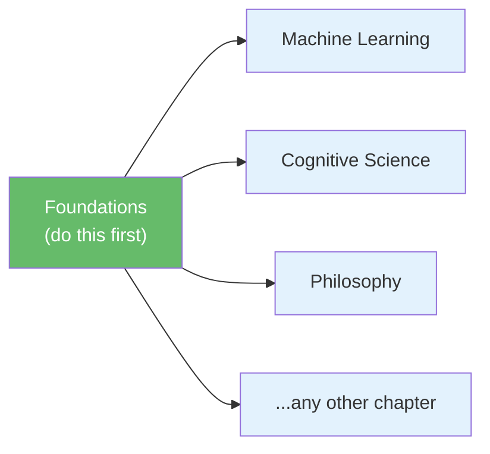

# Learning Path: Foundations

> **TL;DR**: Foundations are the essential building blocks every topic depends on — math, logic, reasoning patterns, and mental models. This path sequences them into a curriculum you complete before diving into any specialized chapter. By the end, you'll have a reusable toolkit of core concepts that compound across every subsequent learning path. Currently empty — concepts appear here as foundational sources are ingested [1].

---

## 1. What Are Foundations?

Foundational concepts are the **prerequisite ideas** that show up everywhere. You can't deeply understand machine learning without probability theory. You can't reason about complex systems without basic logic. You can't evaluate scientific claims without the scientific method.

| A foundation is... | A foundation is NOT... |
|--------------------|------------------------|
| A building block used across many topics | A domain-specific technique |
| Something you learn once and reuse forever | Something you outgrow |
| Abstract enough to transfer across domains | Tied to one tool or framework |
| Worth spending extra time on early | Something to skip to get to "the real stuff" |

> **The compound interest of learning**: Every hour spent on foundations saves 3–5 hours later — you won't hit walls caused by missing prerequisites, and you'll recognize patterns across topics that learners who skip ahead miss entirely [2].

---

## 2. Visual Overview

*Mermaid chart will appear here as concepts are ingested.*

> **Note**: Once concepts are added, this chart visualizes the learning sequence. Click any node in Obsidian to open that concept page.



---

## 3. Path Sequence

*No nodes yet. Concepts will be added here as foundational sources are ingested.*

When concepts arrive, each node in this section will follow this pattern:

```
### N. [[concept-name]]
**Prerequisites**: None
**Difficulty**: foundational
**Overview**: (3–5 sentences describing what this concept is, why it matters, and how it connects to broader learning goals.)
```

---

## 4. How Foundations Fit Into the Bigger Picture



> **Foundations feed everything.** Unlike topic chapters which are independent, foundations sits upstream of every other chapter. That's why it's node #1 in the master learning path with no prerequisites [1].

---

## 5. What To Expect

| Stage | What happens |
|-------|-------------|
| **Before ingestion** | This page is a skeleton — structure ready, zero content |
| **After first foundational source** | 3–10 concept nodes appear in sequence, Mermaid chart populates |
| **After 3–5 foundational sources** | Nodes may reorder, branch points may emerge, estimated duration updates |
| **Mature state** | 10–30 nodes covering math, logic, reasoning, and mental models |

---

## References

[1] Project AGENTS.md — GengsuWiki repository. (2026). *Section: Chapter Organization — "foundations/ — Really fundamental basic concepts needed to master a topic"*. `D:/PROJECTS/GengsuWiki/AGENTS.md`

[2] Hattie, J. (2008). *Visible learning: A synthesis of over 800 meta-analyses relating to achievement*. Routledge. https://doi.org/10.4324/9780203887332
