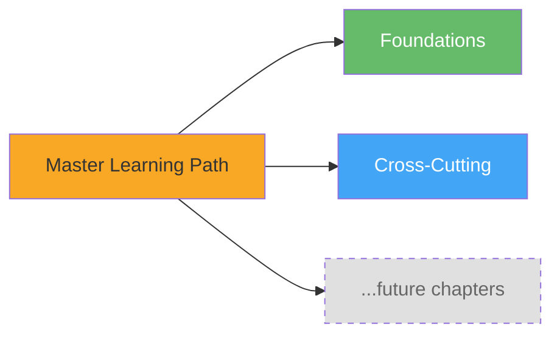
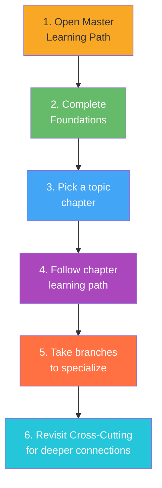

# Wiki Index

> **TL;DR**: The central navigation hub for this knowledge base. Start with the Master Learning Path to find your sequence through all chapters, browse the concept index (auto-populated by `.base` views), or jump directly to sources. Everything here updates automatically as content is ingested — no manual index maintenance needed [1].

---

## 1. Master Learning Path

The **[[_learning-path|Master Learning Path]]** is your starting point. It sequences all chapters into a curriculum, tells you which order to tackle them, where to branch based on your interests, and how everything fits together.

> **Rule of thumb**: If you don't know where to start, start at the Master Learning Path. It's designed to be the single entry point for every learner [1].

---

## 2. Chapter Learning Paths

Each chapter has its own `_learning-path.md` — a structured curriculum that sequences the concepts within that topic. Pick a direction from the master path, then dive into the chapter below.

| # | Learning Path | Chapter Folder | Nodes | Status |
|---|---------------|----------------|-------|--------|
| 1 | [[concept/foundations/_learning-path\|Foundations]] | `foundations/` | 0 | draft |
| 2 | [[concept/cross-cutting/_learning-path\|Cross-Cutting Concepts]] | `cross-cutting/` | 0 | draft |

*More chapter learning paths appear here automatically as concepts are ingested into topic chapters.*

---

### How to Use Learning Paths — Step by Step

1. **Start at the Master Learning Path** — it sequences the chapters themselves
2. **Begin at Foundations** — fundamental concepts every topic builds on. No prerequisites.
3. **Browse Cross-Cutting Concepts** — ideas that span multiple domains. Best after 1+ topic chapters.
4. **Pick a topic chapter** learning path that matches your interest (appears as chapters are created)
5. **Follow the sequence linearly**, or take branches when you want to specialize
6. **Each node links to a concept page** with full details, sources, and related pages

---

## 3. Concept Index

![[concept-index.base#Concepts by Chapter]]

> **Auto-populating**: This card view groups concepts by chapter and updates in real time as new concept pages are created. No manual entry required [2].

---

## 4. Sources

![[source-inventory.base#All Sources]]

> **Auto-populating**: This table lists every ingested source with its file name, date, source count, status, and tags. New rows appear automatically when source summary pages are created [2].

---

## 5. Quality Dashboard

![[lint-dashboard.base#Draft Pages (needs review)]]

> **Auto-populating**: This view surfaces all pages marked `status: draft`, helping you identify content that needs review or completion. The full lint dashboard with additional filters is at [[lint-dashboard.base]] [2].

---

## 6. Quick Reference

| I want to... | Go here |
|-------------|---------|
| Start learning from scratch | [[_learning-path\|Master Learning Path]] |
| Browse all concepts by chapter | [[concept-index.base\|Concept Index]] |
| See what sources have been ingested | [[source-inventory.base\|Source Inventory]] |
| Find pages that need work | [[lint-dashboard.base\|Lint Dashboard]] |
| See what operations were performed | [[log\|Operations Log]] |
| Understand the folder structure | [[concept/README\|Concept Directory Structure]] |

---

## References

[1] Project AGENTS.md — GengsuWiki repository. (2026). *Section: Learning Path System & Rules — "Always update wiki/index.md and wiki/log.md after changes"*. `D:/PROJECTS/GengsuWiki/AGENTS.md`

[2] Obsidian Bases Plugin. (2024). *Bases: database-like views for your vault*. https://github.com/marcusolsson/obsidian-bases
